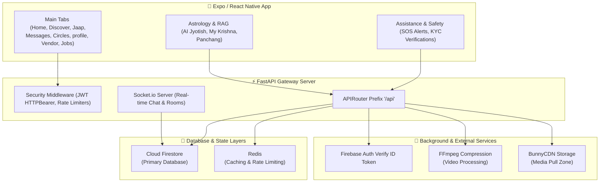
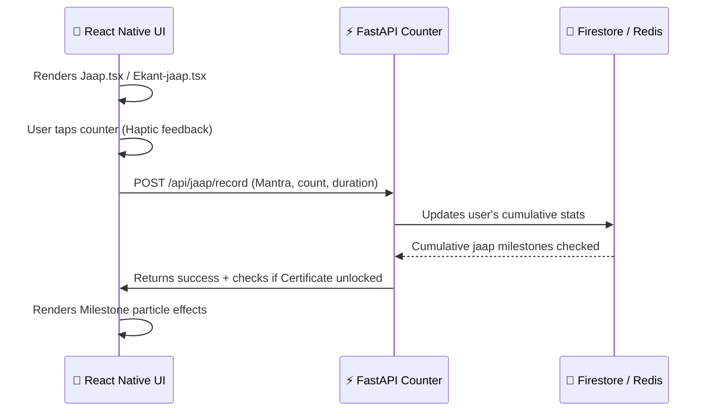

# 🌌 Brahmand (Sanatan Lok) - Complete Application Feature Structure

Welcome to the comprehensive feature and architecture documentation for the **Brahmand (Sanatan Lok)** ecosystem. This document maps out how the front-end application (React Native/Expo) integrates with the high-performance backend (FastAPI, Firestore, Socket.io) to deliver a modern, secure, and feature-rich digital sanctuary for spiritual practices, community building, astrology, and emergency assistance.

---

## 🏗️ System Architecture Overview

The diagram below shows how the client-side screens communicate with the backend services, real-time communication modules, and database systems.



---

## 📂 Core Feature Modules & Directory Structure

Here is a detailed breakdown of the functional modules that power Brahmand, mapped to their client pages and server controllers.

### 1. Authentication & Digital Identity (Sanatan Passport)

The identity system is built on **Firebase Phone Auth** directly. The React Native mobile client triggers the OTP verification using the client-side Firebase SDK. Once the OTP is successfully verified, the client sends the Firebase ID Token to the backend API. The backend verifies the token directly against the Firebase Admin SDK to log in or register the user profile.

> **Note:** All subsequent authenticated calls are guarded by the `verify_token` middleware, which expects a standard HTTP `Authorization: Bearer <JWT>` header.

| Feature / Action | Client-Side Screens | Backend Router / Service | Description |
| :--- | :--- | :--- | :--- |
| **Verify ID Token** | `frontend/app/auth/*` | `verify_firebase_token` | Validates client-side Firebase ID tokens on the server. |
| **Register User** | `frontend/app/auth/*` | `/api/auth/register` | Creates a new user profile document after token verification. |
| **Anonymous Mode** | `frontend/app/index.tsx` | `/api/auth/login-anonymous` | Allows guest login via test/anonymous credentials (bypassing OTP). |
| **Logout** | `frontend/app/settings/*` | `/api/auth/logout` | Disables current session and clears FCM push notification tokens. |
| **Digital Passport** | `frontend/app/passport/*` | `routes/user_routes.py` | Displays the user profile card containing badge progress and Gotra. |

---

### 2. Jaap & Chanting Counter (Spiritual Progress Tracker)

The Jaap module is one of the key interactive features of the application, allowing both private (Ekant) and group (Live) chanting sessions.

> **Tip:** The counter includes high-performance animations, background audio playback assistance, and custom audio players with a gradient theme.



* **Ekant Jaap** (`ekant-jaap.tsx`): Offline/Online solitary chanting with multiple visual counter backgrounds.
* **Live Jaap Rooms** (`live-jaap-welcome.tsx`): Group chant sessions utilizing WebRTC (Coturn TURN servers and Agora audio streams) for audio synchronization.
* **Jaap Certificates** (`/api/jaap/certificates`): Generates and stores printable achievements for users completing cumulative milestones (e.g. 11,000, 100,000 chants).
* **Live Global Chanter Counter** (`/api/jaap/active-count`): Displays real-time online chanters worldwide using Socket.io subscriptions.

---

### 3. Astrology (Kundli, Panchang & AI Jyotish)

Provides extensive astronomical calculations, horoscope matching, and conversational Vedic wisdom.

> **Important:** The RAG (Retrieval-Augmented Generation) pipeline utilizes semantic search database indexing (ChromaDB) to fetch specific Sanskrit verses from the Bhagavad Gita to answer life query prompts.

```
                   ┌──────────────────────────────────────┐
                   │  Astrology.tsx / AI-Jyotish Screen  │
                   └──────────────────┬───────────────────┘
                                      │
                       Inputs Birth Date/Time/Coords
                                      ▼
                   ┌──────────────────────────────────────┐
                   │    FastAPI /api/user/saved-kundlis   │
                   └──────────────────┬───────────────────┘
                                      │
                   ┌──────────────────┴───────────────────┐
                   │               Services               │
                   └──────┬────────────────────────┬──────┘
                          │                        │
       Calculates Charts (D1, D9)         Queries RAG Pipeline (Gita RAG)
                          │                        │
                          ▼                        ▼
               Kundli Layout Display       "My Krishna" Conversational Chat
```

* **Panchang Dashboard** (`panchang.tsx`): Displays comprehensive daily Tithi, Paksha, Nakshatra, Yoga, Sunrise, Sunset, and Vrat info.
* **Kundli Generator** (`astrology.tsx`): Generates saved astrological profiles and coordinates calculations.
* **My Krishna Chatbot** (`my-krishna.tsx`): An interactive chat interface powered by the `services/krishna_rag_service.py` to get guidance directly from Lord Krishna's verses.

---

### 4. Communities, Circles & Real-Time Messaging

A unified messaging hub bridging broad local communities with close private networks (Circles) and individual DMs.

| Channel Type | Endpoint Routes | Storage Model | Socket Events |
| :--- | :--- | :--- | :--- |
| **Community Forums** | `/api/messages/community/...` | `/communities/{id}/messages` | `community:new_message` |
| **Circles (Private Groups)** | `/api/messages/circle/...` | `/circles/{id}/messages` | `circle:new_message` |
| **Direct Messages** | `/api/messages/dm/...` | `/conversations/{id}/messages` | `dm:new_message` |

* **Circles Management** (`circles.tsx`): Create close circles where membership requires admin approval or invite codes.
* **Offensive Content Block** (`offensive_detector.py`): Automatically scans message payloads on the server; blocks offensive terms and returns reasons without writing to databases.

---

### 5. Help Requests & Emergency SOS System

An active safety net that geolocates and broadcasts request alerts to nearby community members in times of urgent need.

> **Caution:** The SOS feature is highly sensitive. It tracks user's last coordinates (latitude/longitude) to calculate geographic distance rings (1km, 5km, 10km) to ensure alerts are sent only to active local users.

* **Emergency Categories**:
  1. 🩺 **Medical**: Assistance for hospital check-ins and emergency support.
  2. 🩸 **Blood**: Specific blood type emergency requests linked to nearby blood banks or users.
  3. 💵 **Financial**: Verified community fundraising for urgent local causes.
  4. 🍲 **Food / Annadan**: Meals coordination for stranded or needy people.
* **Interest/Verify Flow**: Users can mark "Interest" to help or "Verify" the authenticity of a request. Verified badges prevent spam.

---

### 6. Media Feed & Video Upload Pipeline

Allows sharing announcements, videos, and post feeds with local community members.

```
[Local Video/Image] ──► Upload (formdata) ──► FastAPI Router /posts/upload
                                                 │
                                                 ├──► [Background Worker] FFmpeg Compression
                                                 │
                                                 ├──► Uploads compressed assets to BunnyCDN / Firebase Storage
                                                 │
                                                 └──► Publishes Post Document in Firestore
```

* **High-Efficiency Processing**: Includes native video compression (`_compress_video`) and FFmpeg scaling configurations to reduce mobile data usage on playback.
* **BunnyCDN Integration**: Integrates directly with high-speed pull zones to bypass standard Firebase storage bandwidth costs for viral feed videos.

---

### 7. Interactive Vedic Library (Scriptures Reader)

An offline-capable scriptural book reader supporting clean styling, progression trackers, and translation toggles.

* **Supported Scriptures**:
  * **Bhagavad Gita**: Chapter-by-chapter and verse-by-verse view with Sanskrit accents.
  * **Four Vedas**: Rigveda, Yajurveda (Sama/Yajur), Atharvaveda chapters.
  * **Epic Literatures**: Complete Mahabharata parvas, Ramayana, and Ramcharitmanas kaandas.
  * **Upanishads**: Interactive Upanishad selections.

---

### 8. Local Business Directory (Vendors & Jobs Board)

Bridges local commerce with the community, allowing localized search and employment directories.

* **Vendor Catalogue** (`vendor.tsx`): Displays local business coordinates, photos gallery, item descriptions, and delivery ranges.
* **KYC Lock**: Vendors must submit identity papers through `kyc-submit.tsx` to unlock promotional postings.
* **Jobs Board** (`(tabs)/jobs`): Matches local businesses seeking assistance (temple caretakers, event organizers, local deliveries) with applicants.

---

## 🔒 Security & Quality Controls

* **Rate Limiters**: Specific restrictions applied to authentication code requests (`auth_rate_limit`), messaging (`messaging_rate_limit`), and media uploads (`upload_rate_limit`) in Redis cache to defend against automated scripting.
* **Data Sanitization**: Pydantic v2 schemas (`backend/models/schemas.py`) enforce input format constraints before hitting services.
* **FFmpeg Auto-Discovery**: The video routing verifies FFMPEG binaries dynamically at launch to prevent server hangs on compression tasks.
